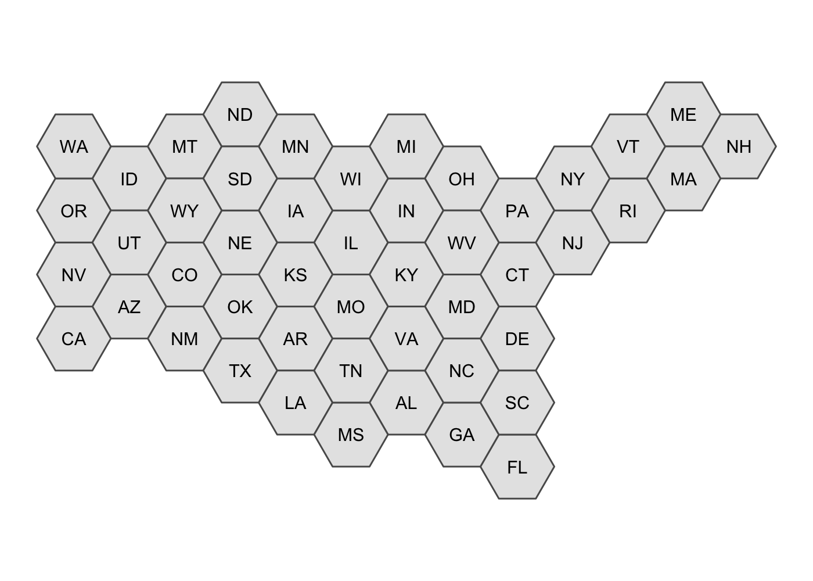
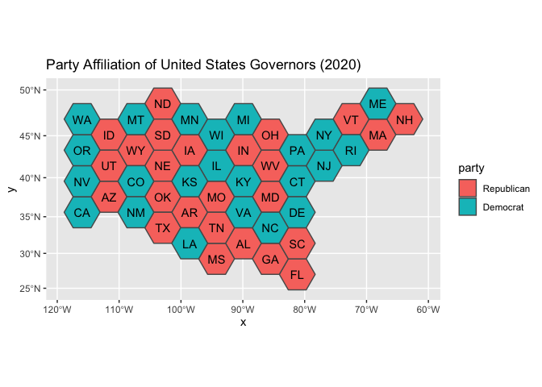
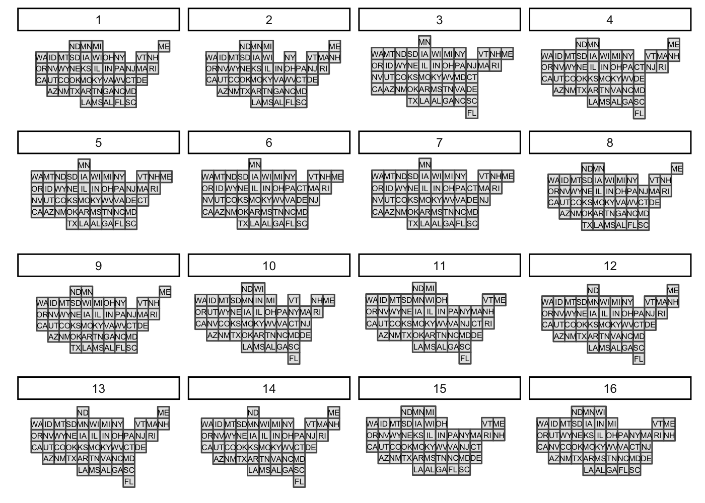

<!-- README.md is generated from README.Rmd. Please edit that file -->

# tilemaps

<!-- badges: start -->

[](https://github.com/kaerosen/tilemaps/actions)
<!-- badges: end -->

The `tilemaps` package implements an algorithm for generating maps,
known as tile maps, in which each region is represented by a single tile
of the same shape and size. When creating a tile map, the goal is to
arrange tiles in a manner that preserves local relationships between
regions, as well as the overall shape of the original map. The algorithm
implemented in this package was proposed by Graham McNeill and Scott
Hale in the paper *“Generating Tile Maps”* (2017). Using a tile map is
advantageous when trying to visualize data where the importance of a
region does not depend on the geographic area of the region. Tile maps
prevent regions with large areas from dominating a map and prevent
regions with small areas from going unnoticed. The package allows the
user to generate a single tile map or many tile maps, which can be
compared by using cost functions or by plotting the maps.

## Installation

You can install the development version from
[GitHub](https://github.com/) with:

``` r
# install.packages("devtools")
devtools::install_github("kaerosen/tilemaps")
```

## Example

To create a single tile map, the `generate_map()` function can be used.
In the following example, a tile map with flat-topped hexagons is
generated for the contiguous United States using the `governors`
dataset, which is part of the `tilemaps` package.

``` r
library(tilemaps)
library(sf)
library(dplyr)
library(ggplot2)

governors <- governors %>%
  mutate(tile_map = generate_map(geometry, square = FALSE, flat_topped = TRUE))

ggplot(governors) +
  geom_sf(aes(geometry = tile_map)) +
  geom_sf_text(aes(geometry = tile_map, label = abbreviation),
               fun.geometry = function(x) st_centroid(x)) +
  theme_void()
```



The `generate_map()` function requires an object of class `sfc_POLYGON`
or `sfc_MULTIPOLYGON` as input. If the coordinates of the `sfc` object
are in terms of longitude and latitude, the coordinates will need to be
transformed to a planar projection before creating the tile map. The
`square` argument controls whether the tiles are squares or hexagons,
and the `flat_topped` argument controls whether or not hexagons are
flat-topped.

Once a tile map has been created, coloring tiles according to another
variable is simple. In the following code, the states are colored
according to the party affiliation of the governor. This is an example
of a situation where it is useful to use a tile map, instead of a
regular map, because each state has only one governor, regardless of the
area or population of the state.

``` r
ggplot(governors) +
  geom_sf(aes(geometry = tile_map, fill = party)) +
  geom_sf_text(aes(geometry = tile_map, label = abbreviation),
               fun.geometry = function(x) st_centroid(x)) +
  scale_fill_brewer(palette = "Set1") +
  ggtitle("Party Affiliation of United States Governors (2020)") +
  theme_void()
```



To create and compare more than one tile map, the `many_maps()` function
can be used. In the following example, 16 candidate tile maps are
generated and plotted.

``` r
us_maps <- many_maps(governors$geometry, governors$abbreviation,
                     prop = c(0, 0.1), interpolate = c(0.5, 1),
                     smoothness = c(0, 20), shift = list(c(0,0), c(0,0.5)))
```



The `prop`, `interpolate`, `smoothness`, and `shift` arguments add
variation at different steps in the algorithm to create different
candidate tile maps. The total number of maps generated by the
`many_maps()` function is the product of the lengths of these arguments.
The output of the `many_maps()` function is a data frame in which each
row corresponds to one map and the columns contain the generated maps,
the parameters used for creating the maps, and the costs associated with
each map. The different sources of variation and types of costs are
discussed in the `tilemaps` vignette.

The plot of all the candidates maps shown above can be generated using
the `plot_many_maps()` function. The function requires a list of maps,
which are of class `sfc_POLYGON`, and the labels for the regions of the
map. Below is code for how the `plot_many_maps()` function can be used
to create the same plot as before.

``` r
plot_many_maps(us_maps$map, governors$abbreviation)
```

# References

McNeill, Graham, and Scott A Hale. 2017. “Generating Tile Maps.” In
*Computer Graphics Forum*, 36:435–45. 3. Wiley Online Library.
